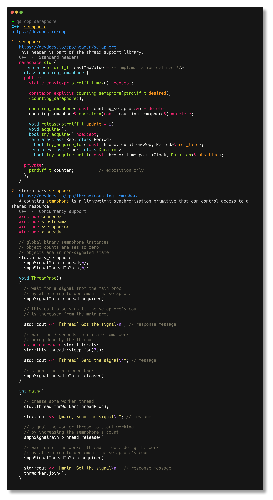
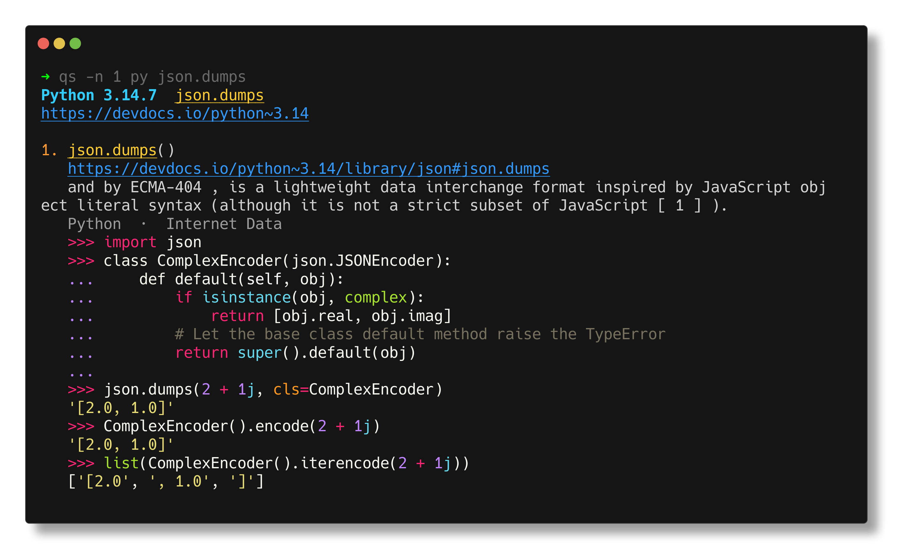
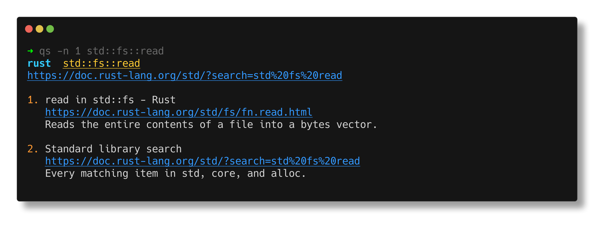
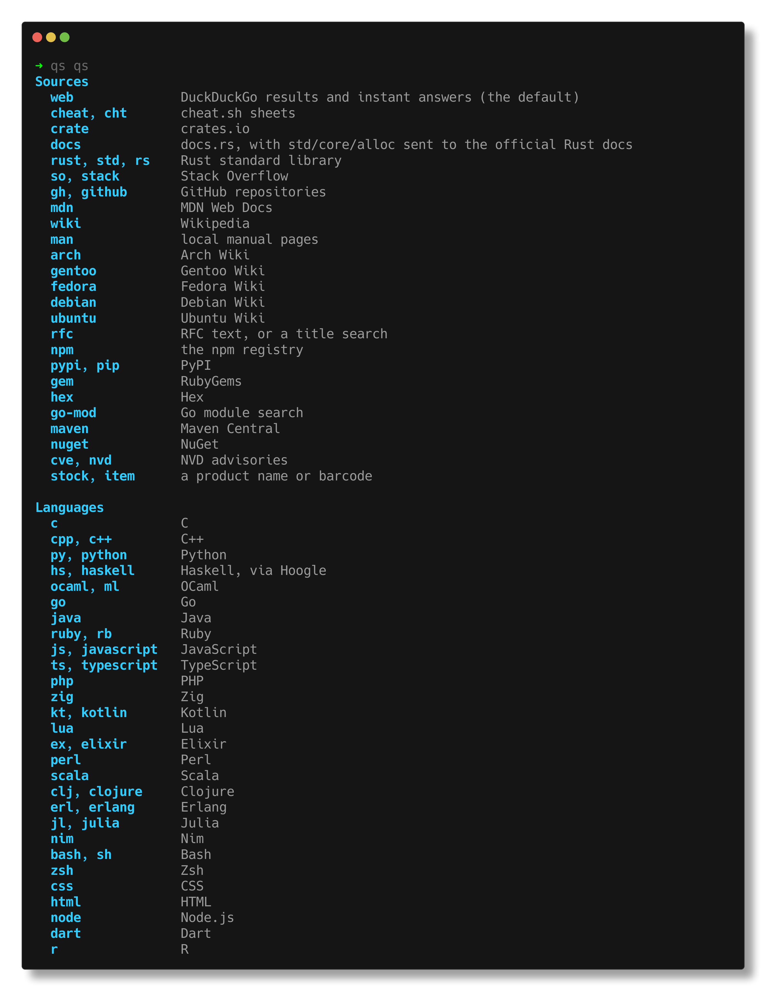

# qs

Fast lookups from the terminal. The default is a web search. A leading word picks a manual, a doc set, a package registry, or a wiki.

The binary is `quicksearch`. The command name is `qs`.

qs is free software under the GNU General Public License, version 3 or any later version. See `LICENSE`.


## Install

Download a binary, or build it yourself.

### Download

The installers fetch the latest release binary for this machine. Linux builds need glibc and OpenSSL.

```sh
curl -fsSL https://raw.githubusercontent.com/pragundamani/quicksearch/main/install.sh | bash -s -- --release
```

```sh
curl -fsSL https://raw.githubusercontent.com/pragundamani/quicksearch/main/install.py | python3 - --release
```

```powershell
$script = Join-Path $env:TEMP "qs-install.ps1"
Invoke-WebRequest https://raw.githubusercontent.com/pragundamani/quicksearch/main/install.ps1 -OutFile $script
powershell -File $script -Release
```

From a clone: `./install.sh --release`, `python3 install.py --release`, or `powershell -File install.ps1 -Release`.

Other archives are on the [latest release](https://github.com/pragundamani/quicksearch/releases/latest).

Linux x86_64:

```sh
curl -LO https://github.com/pragundamani/quicksearch/releases/latest/download/qs-x86_64-unknown-linux-gnu.tar.gz
tar -xzf qs-x86_64-unknown-linux-gnu.tar.gz
install -m 755 qs "$HOME/.local/bin/qs"
```

Linux ARM:

```sh
curl -LO https://github.com/pragundamani/quicksearch/releases/latest/download/qs-aarch64-unknown-linux-gnu.tar.gz
tar -xzf qs-aarch64-unknown-linux-gnu.tar.gz
install -m 755 qs "$HOME/.local/bin/qs"
```

macOS Apple Silicon:

```sh
curl -LO https://github.com/pragundamani/quicksearch/releases/latest/download/qs-aarch64-apple-darwin.tar.gz
tar -xzf qs-aarch64-apple-darwin.tar.gz
install -m 755 qs "$HOME/.local/bin/qs"
```

macOS Intel:

```sh
curl -LO https://github.com/pragundamani/quicksearch/releases/latest/download/qs-x86_64-apple-darwin.tar.gz
tar -xzf qs-x86_64-apple-darwin.tar.gz
install -m 755 qs "$HOME/.local/bin/qs"
```

Windows x86_64:

```powershell
curl.exe -LO https://github.com/pragundamani/quicksearch/releases/latest/download/qs-x86_64-pc-windows-msvc.zip
tar -xf qs-x86_64-pc-windows-msvc.zip
```

Windows ARM:

```powershell
curl.exe -LO https://github.com/pragundamani/quicksearch/releases/latest/download/qs-aarch64-pc-windows-msvc.zip
tar -xf qs-aarch64-pc-windows-msvc.zip
```

### Build it yourself

Linux and macOS:

```sh
git clone https://github.com/pragundamani/quicksearch.git
cd quicksearch
./install.sh
```

Windows:

```powershell
git clone https://github.com/pragundamani/quicksearch.git
cd quicksearch
powershell -File install.ps1
```

Or use Python on any of them:

```sh
git clone https://github.com/pragundamani/quicksearch.git
cd quicksearch
python3 install.py
```

Or build without installing:

```sh
cargo build --release --target-dir target
./target/release/quicksearch price of gold in inr
```

With no query, `qs` opens `$VISUAL` or `$EDITOR`. Options go before the query.

## Examples

```sh
qs price of gold in inr
qs how to read a file in rust
qs std::fs::read
qs python pathlib.Path
qs c printf
qs haskell foldl
qs dnf rust
qs dnf install
qs cargo build
qs arch pacman
qs rfc 9110
qs npm lodash
qs cve openssl
qs 3017620422003
qs --open 2 QUERY
qs history
```

`qs dnf rust` shows package info. It does not install or remove anything. `qs cargo build` opens the `cargo-build` manual. `qs how to upgrade cargo binaries` stays a web search.

## Sources

| Leading word | Lookup |
|---|---|
| `web` | DuckDuckGo. Also forces a web search when another word would route the query |
| `cheat`, `cht` | cheat.sh |
| `crate` | crates.io |
| `docs` | docs.rs. `std`, `core`, and `alloc` go to the official Rust docs |
| `rust`, `std`, `rs` | Rust standard library |
| `so` | Stack Overflow |
| `gh` | GitHub repositories |
| `mdn` | MDN |
| `wiki` | Wikipedia |
| `man` | local manual pages |
| `arch`, `gentoo`, `fedora`, `debian`, `ubuntu` | that distro's wiki |
| `rfc` | an RFC, or a title search |
| `npm`, `pypi`, `pip`, `gem`, `hex`, `go-mod`, `maven`, `nuget` | that package registry |
| `cve`, `nvd` | NVD advisories |
| `stock`, `item` | a product name or barcode |

## Languages

A leading word searches that language. `qs lang py` fuzzy-finds a shorthand.

| Leading word | Docs |
|---|---|
| `c` | C |
| `cpp`, `c++` | C++ |
| `py`, `python` | Python |
| `hs`, `haskell` | Haskell, via Hoogle |
| `ocaml`, `ml` | OCaml |
| `go` | Go |
| `java` | Java |
| `ruby`, `rb` | Ruby |
| `js`, `javascript` | JavaScript |
| `ts`, `typescript` | TypeScript |
| `php` | PHP |
| `zig` | Zig |
| `kt`, `kotlin` | Kotlin |
| `lua` | Lua |
| `ex`, `elixir` | Elixir |
| `perl` | Perl |
| `scala` | Scala |
| `clj`, `clojure` | Clojure |
| `erl`, `erlang` | Erlang |
| `jl`, `julia` | Julia |
| `nim` | Nim |
| `bash`, `sh` | Bash |
| `zsh` | Zsh |
| `css` | CSS |
| `html` | HTML |
| `node` | Node.js |
| `dart` | Dart |
| `r` | R |

`rust`, `std`, and `rs` stay on the Rust standard library, in the sources table above.

`!wiki` and the other known bangs use those sources. Any other bang follows DuckDuckGo, for example `qs !aur paru`.

`qs topic net` fuzzy-finds broader concepts such as linux, networking, security, cloud, mail, and editors. Then search with the shorthand: `qs linux iptables`, `qs sec ssh`, `qs db jsonb`.

A command name opens its manual. A subcommand opens that page. A package name shows package info.

```sh
qs dnf
qs apt install
qs brew install
qs flatpak install
qs podman build
```

`dnf`, `rpm`, `apt`, `pacman`, `brew`, `flatpak`, `zypper`, and `winget` can show package info. `cargo`, `podman`, and `snap` open manuals.

An 8, 12, 13, or 14 digit barcode is a product lookup. `qs 1912` stays a web search.

## Screenshots

`qs cpp semaphore`



`qs -n 1 py json.dumps`



`qs -n 1 std::fs::read`



`qs qs`



## Options

```sh
qs -n 10 QUERY       # 1 to 20 results, default 5
qs --open QUERY      # open the first hit
qs --open 2 QUERY    # open hit 2
qs --copy QUERY      # copy the first URL
qs --json QUERY
qs --no-color QUERY  # or set NO_COLOR
qs history           # recent searches
qs history 3         # run a saved search again
```

## Your own source

Custom sources live in `~/.config/quicksearch/sources` on Linux, `~/Library/Application Support/quicksearch/sources` on macOS, and `%APPDATA%\quicksearch\sources` on Windows. One source per line. `#` starts a comment. `{query}` is the encoded rest of the command. Built-in words win over a custom line.

```
aur https://aur.archlinux.org/packages?K={query}
```

Doc indexes and product lookups are cached under `~/.cache/quicksearch` on Linux, `~/Library/Caches/quicksearch` on macOS, and `%LOCALAPPDATA%\quicksearch` on Windows. `$XDG_CACHE_HOME` and `$XDG_CONFIG_HOME` still win when they are set.
